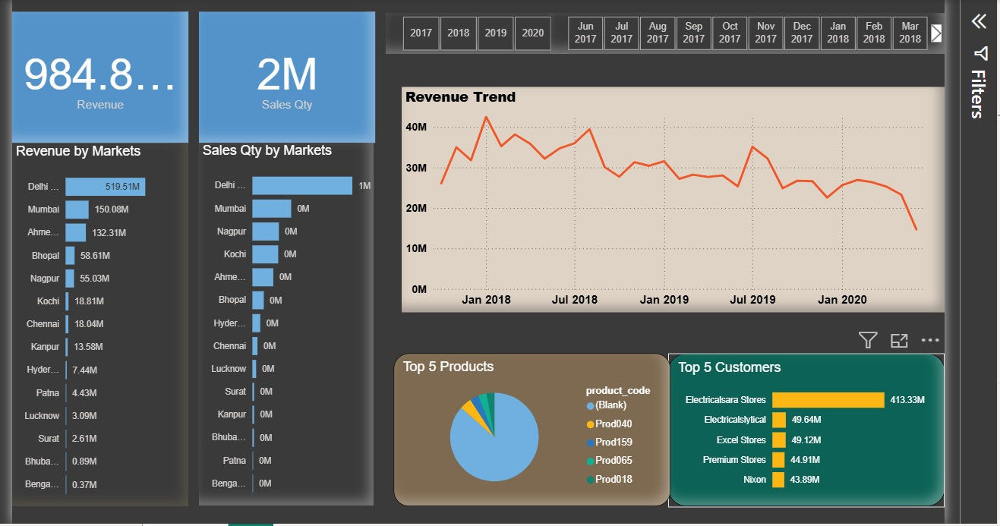

# Sales Analytics Dashboard using Power BI

## 📌 Project Overview
Developed an automated sales analytics dashboard in Power BI to analyze a comprehensive sales dataset spanning 4 years (2017–2020). The project processes 150,000+ historical transactions, turning raw data into interactive, actionable business insights for stakeholders.

---

## 💡 Business Impact & Value Delivered
* **Automated Reporting:** Transitioned from manual reporting processes, reducing overall data analysis and formatting time by **80%**.
* **Enhanced Readability:** Designed a customized color palette and optimized chart layouts for a clean visual hierarchy, ensuring smooth stakeholder navigation.
* **Data-Driven Decisions:** Enabled real-time visibility into regional market trends and customer behavior to target growth opportunities.

---

## 🛠️ Project Phases & Technical Workflow

### 🔹 Phase 1: Data Exploration (SQL)
* Conducted initial analysis of raw sales data using SQL queries on **MySQL** to thoroughly understand the dataset structure, table relationships, and verify key metrics.

### 🔹 Phase 2: Data Cleaning & ETL (Extract, Transform, Load)
* Utilized **Power Query Editor** in Power BI for extensive data cleaning.
* **Applied Transformations:**
  * Cleaned inconsistent records by removing blank rows.
  * Eliminated erroneous transactions with sales values <= 0.
  * Handled duplicate entries to maintain data integrity.
  * Normalized currency structures by converting all relevant regional metrics into **INR**.

### 🔹 Phase 3: Interactive Dashboard Development
Engineered a dynamic single-page dashboard featuring core executive metrics and cross-filtering capabilities:
* **Key Performance Indicators (KPIs):** Instant tracking of **Total Revenue (~984.8M)** and **Total Sales Quantity (2M units)**.
* **Revenue Trend Analysis:** A continuous timeline chart mapping monthly and yearly revenue performance from Jan 2018 through Jan 2020.
* **Market-Wise Segmentation:** Dual bar charts evaluating and comparing both **Revenue by Markets** and **Sales Qty by Markets** across major cities (Delhi, Mumbai, Ahmedabad, Nagpur, etc.).
* **Top 5 Product Performance:** A distribution pie/donut chart isolating the highest revenue-generating product codes.
* **Top 5 Customers:** A horizontal bar chart identifying high-value buyers to help optimize client management.

---

## ⚙️ Setup & Installation
1. Download and install **Power BI Desktop**.
2. Clone this repository or download the `sales_dashboard.pbix` file.
3. Open `sales_dashboard.pbix` in Power BI Desktop to explore the interactive visual elements.
   
